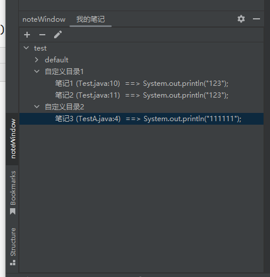
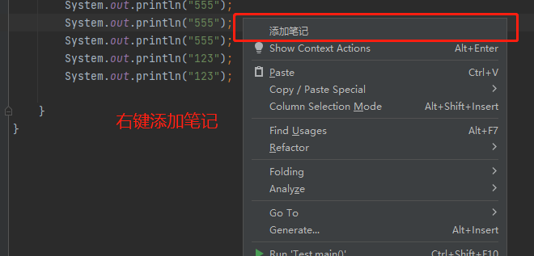
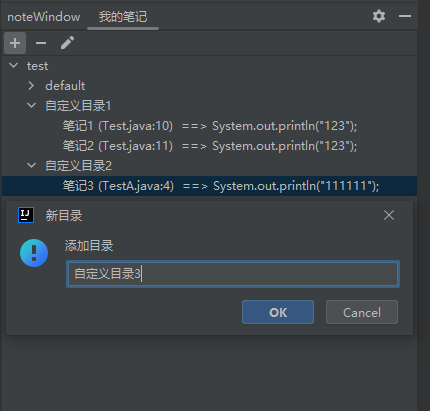
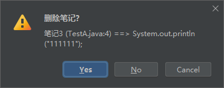

## IDEA代码书签工具 
项目由来:
idea社区版,自带Bookmarks笔记工具有一些bug,例如切换git分支时,书签会全部消失。   
奈何看源码提issue可能需要花更多时间,所以先学习掌握如何开发一个插件吧。

## 开发历程
耗时2个周末,主要花费时间再阅读idea插件开发文档,idea封装的接口挺方便,基本没什么开发量,   就是找接口比较费时间
2022.06.12

## 效果图
   
   
      



## 思路与实现
- 插件项目搭建[文档](https://plugins.jetbrains.com/docs/intellij/gradle-build-system.html)
- 怎么在IDEA创建一个窗口展示笔记内容？   
idea的插件生命周期通过**plugin.xml**配置,初始化时会调用ToolWindowFactory接口,用于创建自定义窗口
```xml
<extensions defaultExtensionNs="com.intellij">
  <!--IDEA 初始化时回调该接口,可生成一个自定义笔记窗口展示-->
  <toolWindow id = "noteWindow" factoryClass="com.chuanskqi.note.window.NoteWindow" anchor="left"/>
</extensions>
```

- 怎么执行添加笔记,怎么与IDEA交互?
```xml
<actions>
  <!-- 添加笔记Action事件 -->
  <action id="com.chuanskqi.note.action.Pop"
          class="com.chuanskqi.note.action.AddNoteAction" text="添加笔记">
      <!-- 把这个Action事件 绑定到 IDEA右键点击目录上 -->
      <add-to-group group-id="EditorPopupMenu" anchor="first"/>
  </action>
</actions>
```

- 笔记需要哪些参数,如何获取这些信息?   
主要有项目名称,目录,文件名称,代码行号,代码内容,可从**AddNoteAction**点击事件获取
   

- 笔记如何持久化保存,保存到哪里?   
笔记数据不大,直接对象转JSON,保存到当前项目目录下**NoteStorage**   


- 如何展示历史的笔记列表？   
读取笔记文件,刷新笔记展示面板**ShowNoteViewWapper**   
   

- 如何实现点击笔记进行代码跳转?      
调用IDEA内置接口**CodeUtil**

## 参考资料
| IDEA插件生命周期、扩展接口列表                                    | 用途  |
|--------------------------------------------------------------|-----|
| com.intellij.openapi.wm.ToolWindowFactory.ToolWindowFactory  | 可通过该接口自定义一个展示窗口,用于创建笔记窗口 |
| com.intellij.openapi.project.ProjectCloseHandler             | IDEA关闭回调接口,可用于笔记持久化  |
| com.intellij.openapi.actionSystem.AnAction                   | IDEA事件处理接口,用于添加笔记事件处理   |
| com.intellij.openapi.ui.DialogWrapper                        | 对话框容器,可用于笔记展示面板 [文档](https://plugins.jetbrains.com/docs/intellij/dialog-wrapper.html#input-validation)|
| javax.swing.tree.DefaultMutableTreeNode                      | 目录树结构,可用于笔记树展示 [文档](https://plugins.jetbrains.com/docs/intellij/lists-and-trees.html)      |
| com.intellij.openapi.ui.Messages.showEditableChooseDialog    |  IDEA弹出对话框,用于添加笔记到目录|
| com.intellij.openapi.editor.CaretModel#moveToLogicalPosition | 文件跳转,用于笔记跳转|

### 参考链接
[idea官方插件开发文档](https://plugins.jetbrains.com/docs/intellij/welcome.html)   
[同类插件代码参考](https://github.com/xzwb/MarkDownNoteYYF)   
[同类插件代码参考](https://gitee.com/luyaoCode/go-to-implementation)   
[博客参考](https://www.jianshu.com/p/39149b2f9b55)   

